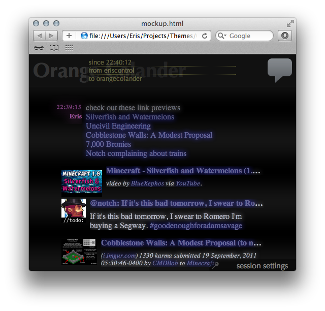

# GentleGlow for Adium

  

Gentle Glow is a message style for Adium that adds thumbnails and metadata for supported links, including YouTube, Imgur and other popular image and video sites. If a site has a public API or an [oEmbed endpoint][oembed], chances are Gentle Glow supports it; if not, [let me know][issues] and I'll probably add it.

There's also built-in support for [Embed.ly][embedly], but it requires an API key to be provided at compile time. Consider it experimental until I find a reasonable way to obscure my own API key.

## Screen Shots
Screen shots come later! For now, here's a screen shot of mockup.html in Safari.

  

## Download
Download the latest version, [Gentle Glow 1.4.0][download], or get the [source code][source] at GitHub.

### Older Versions
* [1.3.1](http://dl.dropbox.com/u/143504/Themes/GentleGlow-1.3.1.tar.bz2)
* [1.3.0](http://dl.dropbox.com/u/143504/Themes/GentleGlow-1.3.0.tar.bz2)

## License
License is [CC-BY-NC-SA][].

[download]: http://goo.gl/dbE1E
[issues]: https://github.com/erisdiscord/adium-gentleglow/issues
[source]: https://github.com/erisdiscord/adium-gentleglow

[cc-by-nc-sa]: http://creativecommons.org/licenses/by-nc-sa/3.0/
[embedly]: http://embed.ly/
[oembed]: http://www.oembed.com/
